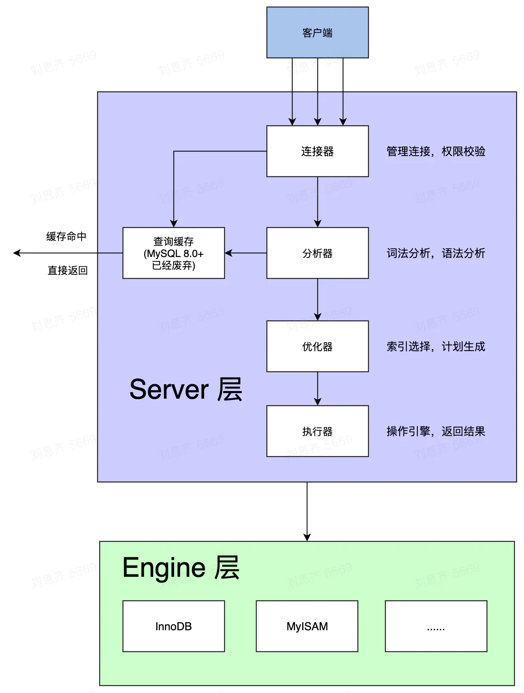

[TOC]

## 参考

- [MySQL 基础技术（二） —— MySQL 是如何更新的](https://www.jianshu.com/p/4006d6ed60d6)
- [MySQL 基础技术（三）—— MySQL 如何保证数据不丢失](https://juejin.cn/post/7019969643657822216#heading-5)
- [带你了解 MySQL Binlog 不为人知的秘密 ](https://www.cnblogs.com/rickiyang/p/13841811.html)
- [mysql查看binlog日志](https://www.cnblogs.com/softidea/p/12624778.html)

# mysql日志

我们知道，磁盘的I/O是有瓶颈的。
如果每次更新都直接写磁盘，`MySQL`很容易就会忙不过来。

因此，为了解决这个问题。
`MySQL`采用了`WAL`技术（`Write-Ahead Logging`），即先写日志，再写磁盘。
 忙的时候，先写日志。等闲下来，一起刷到磁盘。

因此，需要会两个特殊的日志模块，也是今天的主角：`binlog` 和 `redo log`。
 其中，
 `binlog`对应`Server`层的日志。（`Server`层通用）
 `redo log`对应`Engine`层 `innoDB` 引擎的日志系统。

## binlog

> `binlog` 是 `MySQL` 的 `Server` 层通用归档日志。
> `Engine` 层的所有存储引擎都可以使用 `binlog`。

### binlog 的作用：

#### 1. 数据恢复

因为`binlog`详细记录了所有修改数据的 SQL，当某一时刻的数据误操作而导致出问题，或者数据库宕机数据丢失，那么可以根据`binlog`来回放历史数据。

#### 2. 主从复制

为了提高 `MySQL` 的效率，我们经常会做读写分离，即一主多从。
 一个主库（写库），多个从库（读库）。
 这时，从库可以监听主库的 `binlog` 日志，同步写库的所有更改操作。

#### 3. binlog 写入流程

1. 先把 `binlog` 日志写到 `binlog cache`。
2. 事务提交时，将 `binlog cache` 写入 `binlog` 文件

> 参数：`sync_binlog` ，用来控制 `write` 和 `fsync` 的时机。
>  可以根据业务场景的需要，来具体调整。

| **sync_binlog** | **含义**                                                     |
| --------------- | ------------------------------------------------------------ |
| 0               | 每次事务提交只`write`，不`fsync`。（不推荐）                 |
| 1               | 每次事务提交不仅`write`，都会执行 `fsync`。（这个配置是最安全的，不会丢`binlog`日志） |
| N               | 每次提交事务都`write`，累积N个事务后，一起`fsync`。（性能好，但是异常重启会丢N个事务的`binlog`日志） |

设为1是最安全的，在系统故障时最多丢失一个事务的更新，但是会对性能有所影响。

如果 sync_binlog=0 或 sync_binlog大于1，当发生电源故障或操作系统崩溃时，可能有一部分已提交但其binlog未被同步到磁盘的事务会被丢失，恢复程序将无法恢复这部分事务。

#### 4. `binlog`的日志格式

记录在二进制日志中的事件的格式取决于二进制记录格式。支持三种格式类型：

- `Statement`模式：基于 SQL 语句的复制(`statement-based replication-SBR`)
- `Row` 模式：基于行的复制(`row-based replication-RBR`)
- `Mixed` 模式：混合模式复制(`mixed-based replication-MBR`)

在 `MySQL 5.7.7` 之前，默认的格式是 `STATEMENT`，在 `MySQL 5.7.7` 及更高版本中，默认值是 `ROW`。日志格式通过 `binlog-format` 指定，如 `binlog-format=STATEMENT`、`binlog-format=ROW`、`binlog-format=MIXED`。

##### 4.1 Statement

每一条会修改数据的sql都会记录在binlog中
保存每一条修改数据的SQL。
该模式只保存一条普通的SQL语句，不涉及到执行的上下文信息。
因为每台 MySQL 数据库的本地环境可能不一样，那么对于依赖到本地环境的函数或者上下文处理的逻辑 SQL 去处理的时候可能同样的语句在不同的机器上执行出来的效果不一致。

比如像 `sleep()`函数，`last_insert_id()`函数，等等，这些都跟特定时间的本地环境有关

##### 4.2 Row

5.1.5版本的MySQL才开始支持 `row level` 的复制,它不记录sql语句上下文相关信息，仅保存哪条记录被修改。

优点： binlog中可以不记录执行的sql语句的上下文相关的信息，仅需要记录那一条记录被修改成什么了。所以row的日志内容会非常清楚的记录下每一行数据修改的细节。而且不会出现某些特定情况下的存储过程，或function，以及trigger的调用和触发无法被正确复制的问题.

缺点:所有的执行的语句当记录到日志中的时候，都将以每行记录的修改来记录，这样可能会产生大量的日志内容。

> 注：将二进制日志格式设置为ROW时，有些更改仍然使用基于语句的格式，包括所有DDL语句，例如CREATE TABLE， ALTER TABLE，或 DROP TABLE。

##### 4.3 Mixed

从5.1.8版本开始，MySQL提供了Mixed格式，实际上就是Statement与Row的结合。
在Mixed模式下，一般的语句修改使用statment格式保存binlog，如一些函数，statement无法完成主从复制的操作，则采用row格式保存binlog，MySQL会根据执行的每一条具体的sql语句来区分对待记录的日志形式，也就是在Statement和Row之间选择一种。

## redo log

> `redo log` 是 `MySQL` `Engine`层，`InnoDB`存储引擎特有的日志。
> 它保证了`MySQL`的`Crash-Safe`能力。即使`MySQL`发生了异常，重启后，数据也不会丢失。

`redo log` 是物理日志。可以理解成一个固定空间大小的队列，会被无限循环复写。

`InnoDB` 提供了 `innodb_flush_log_at_trx_commit` 参数来控制 `redo log` 写入流程。

| **innodb_flush_log_at_trx_commit** | 含义                                                         |
| ---------------------------------- | ------------------------------------------------------------ |
| 0                                  | 每次事务提交时，`redo log` 只会留在 `redo log buffer`。（风险大，等待每秒 `write` + `fsync` 到 `disk`） |
| 1                                  | 每次事务提交时，都将所有 `redo log` `fsync`到磁盘。（最安全） |
| 2                                  | 每次事务提交时，都将 `redo log` `write` 到 `page cache`。    |

## binlog 和 redo log 的区别是什么

1. binlog 是 MySQL 的 Server 层实现的逻辑日志，所有引擎都可以使用。
    而 redo log 是 InnoDB 引擎特有的物理日志。
2. binlog 是逻辑日志，记录了所有`DDL`、`DML`语句的原始逻辑。
    而 redo log 是物理日志，记录了某个数据页做了什么修改。
3. binlog 不限空间，可以追加写入。
    而 redo log 限制空间大小，只能循环复写。

## 每秒刷盘机制

`InnoDB` 有一个后台线程，**每隔1秒**，就会把 `redo log buffer`中的日志，调用 `write` 写到 `page cache`，然后 `fsync` 持久化到磁盘。

需要注意的是，事务执行中的 `redo log` 也是存在于 `redo log buffer` 的，也会被一起持久化到磁盘。（也就是说，一个还没有提交事务的 `redo log`，也可能已经被持久化到磁盘了）

## 强制刷盘

其实，不光每秒刷盘会提前持久化 `redo log` 到磁盘。

- 当 `redo log buffer` 到达 `innodb_log_buffer_size` （缓冲池大小，默认是8MB）一半的时候，会主动触发 `write` 到文件系统的 `page cache`。
- 并行事务提交，顺带将其他事务的 `redo log buffer` 持久化到磁盘。
   举例：
   事务A 执行到一半，写入了部分 `redo log` 到 `buffer` 中。
   事务B 完成，进行提交。
   如果`innodb_flush_log_at_trx_commit`设置为1，代表每次提交都会全部`fsync`到磁盘。这时候，事务A的 `redo log` 也有部分已经持久化了。
