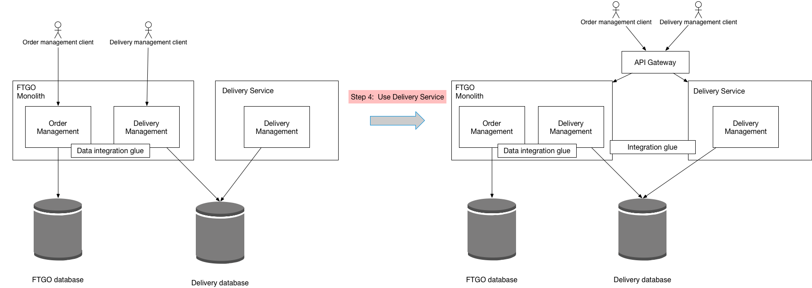

[TOC]

## 参考

[Refactoring a monolith to microservices](https://microservices.io/refactoring/index.html)

# 将单体重构为微服务

## 重构策略

主要有两种重构策略：

- 将新功能作为服务实现(`Implement new functionality as services`)
- 从单体中提取服务(`Extract services from the monolith`)

### 将新功能作为服务实现
> A good way to begin the migration to microservices is to implement significant new functionality as services. This is sometimes easier than breaking apart of the monolith. It also demonstrates to the business that using microservices significantly accelerates software delivery.
> 开始迁移到微服务的一个好方法是实现重要的新功能作为服务。这有时比拆开整块单体更容易。它还向企业表明，使用微服务显著加快了软件交付速度。

### 从单体中提取服务
> While implementing new functionality as services is extremely useful, the only way of eliminating the monolith is to incrementally extract modules out of the monolith and convert them into services. For example, let’s imagine that the FTGO team wants to improve the efficiency of the business and customer satisfaction by rapidly iterating on the courier scheduling algorithm. It will be a lot easier for them to work on the delivery management logic if it’s a separate . To do that, the FTGO team must separate delivery management from order management and convert it into service.
> 虽然将新功能作为服务实现是非常有用的，但消除单体的唯一方法是从单体中逐步提取模块并将其转换为服务。
>
> 例如，让我们想象一下，FTGO 团队希望通过快速使用快递调度算法来提高业务效率和客户满意度。如果它是一个单独的，他们更容易工作交付管理逻辑。为此，FTGO 团队必须将交付管理与订单管理分开，并将其转换为服务。

提取包括以下步骤：Delivery Service

1. 拆分代码，将交付管理转换为单体内的单独、松散耦合的模块
2. 拆分数据库并定义交付管理的单独模式。
3. 定义独立Delivery Service
4. 使用独立Delivery Service
5. 从 FTGO单体中删除旧的、现在未使用的交付管理功能

#### 第 1 步：拆分代码

第一步是将代码拆分，并将交付管理转换为单体内的单独、松散耦合的模块。

#### 第 2 步：拆分数据库

第二步是拆分数据库，并为模块定义单独的数据库模式。ftgo-delivery-service

#### 第 3 步：定义独立Delivery Service

重构过程的第三步是定义独立并部署它。但是，该服务不处理生产流量。相反，例如，它可以在生产中进行测试。Delivery Service

#### 第 4 步：使用独立Delivery Service

重构过程的第四步是使用独立。Delivery Service

#### 第 5 步：从 FTGO 单体中删除交付管理功能

重构过程的第五步是从整体上删除现在过时的交付管理逻辑。

