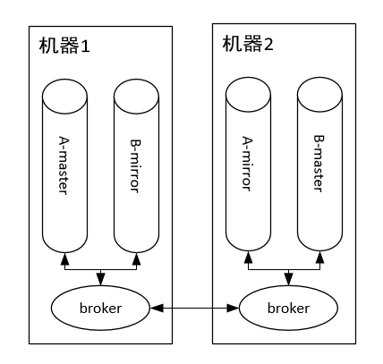
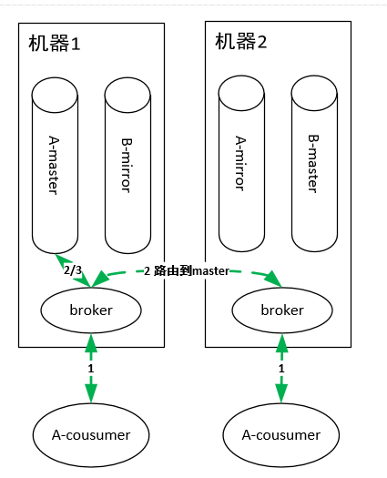
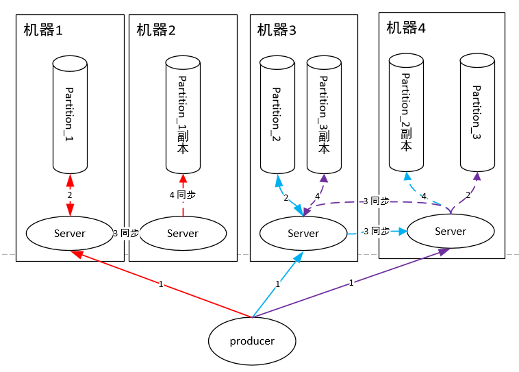
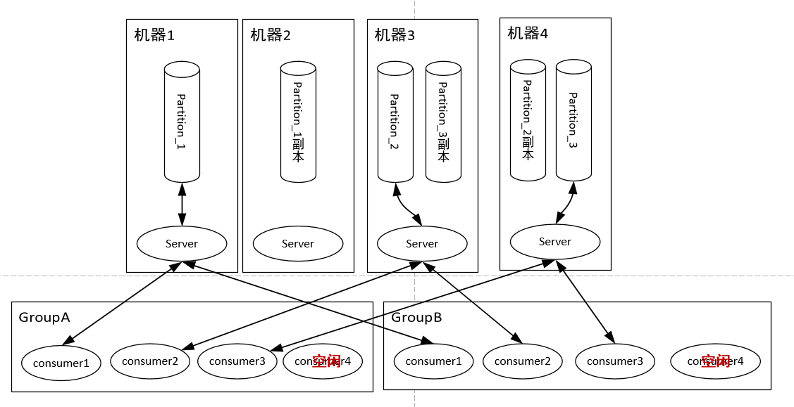

# 参考

- [RabbitMQ和Kafka到底怎么选？](https://www.cnblogs.com/haolujun/p/9632835.html)

## RabbitMQ架构

RabbitMQ是一个分布式系统，这里面有几个抽象概念。

- broker：每个节点运行的服务程序，功能为维护该节点的队列的增删以及转发队列操作请求。
- master queue：每个队列都分为一个主队列和若干个镜像队列。
- mirror queue：镜像队列，作为master queue的备份。在master queue所在节点挂掉之后，系统把mirror queue提升为master queue，负责处理客户端队列操作请求。注意，mirror queue只做镜像，设计目的不是为了承担客户端读写压力。

如上图有两个consumer消费队列A，这两个consumer连在了集群的不同机器上。RabbitMQ集群中的任何一个节点都拥有集群上所有队列的元信息，所以连接到集群中的任何一个节点都可以，主要区别在于有的consumer连在master queue所在节点，有的连在非master queue节点上。

因为mirror queue要和master queue保持一致，故需要同步机制，正因为一致性的限制，导致所有的读写操作都必须都操作在master queue上（想想，为啥读也要从master queue中读？和数据库读写分离是不一样的。），然后由master节点同步操作到mirror queue所在的节点。即使consumer连接到了非master queue节点，该consumer的操作也会被路由到master queue所在的节点上，这样才能进行消费。

原理和消费一样，如果连接到非 master queue 节点，则路由过去。

所以，到这里小伙伴们就可以看到 RabbitMQ的不足：由于master queue单节点，导致性能瓶颈，吞吐量受限。虽然为了提高性能，内部使用了Erlang这个语言实现，但是终究摆脱不了架构设计上的致命缺陷。

## Kafka

说实话，Kafka我觉得就是看到了RabbitMQ这个缺陷才设计出的一个改进版，改进的点就是：把一个队列的单一master变成多个master，即一台机器扛不住qps，那么我就用多台机器扛qps，把一个队列的流量均匀分散在多台机器上不就可以了么？注意，多个master之间的数据没有交集，即一条消息要么发送到这个master queue，要么发送到另外一个master queue。

这里面的每个`master queue` 在`Kafka`中叫做`Partition`，即一个分片。一个队列有多个主分片，每个主分片又有若干副分片做备份，同步机制类似于`RabbitMQ`。

如上图，我们省略了不同的queue，假设集群上只有一个queue（Kafka中叫Topic）。每个生产者随机把消息发送到主分片上，之后主分片再同步给副分片。

队列读取的时候虚拟出一个Group的概念，一个Topic内部的消息，只会路由到同Group内的一个consumer上，同一个Group中的consumer消费的消息是不一样的；Group之间共享一个Topic，看起来就是一个队列的多个拷贝。所以，为了达到多个Group共享一个Topic数据，Kafka并不会像RabbitMQ那样消息消费完毕立马删除，而是必须在后台配置保存日期，即只保存最近一段时间的消息，超过这个时间的消息就会从磁盘删除，这样就保证了在一个时间段内，Topic数据对所有Group可见（这个特性使得Kafka非常适合做一个公司的数据总线）。队列读同样是读主分片，并且为了优化性能，消费者与主分片有一一的对应关系，如果消费者数目大于分片数，则存在某些消费者得不到消息。

由此可见，Kafka绝对是为了高吞吐量设计的，比如设置分片数为100，那么就有100台机器去扛一个Topic的流量，当然比RabbitMQ的单机性能好。
