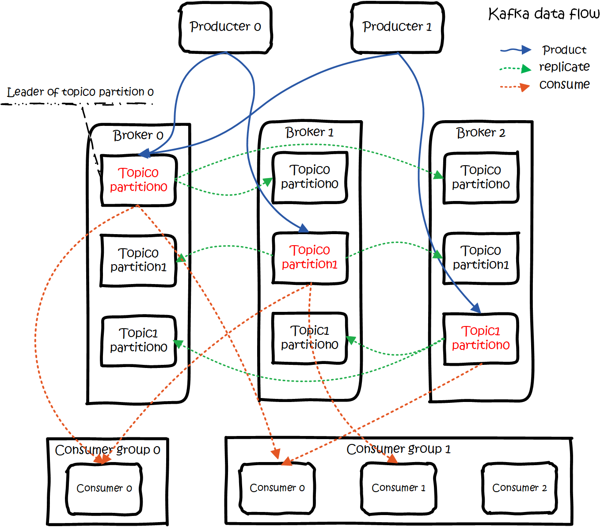
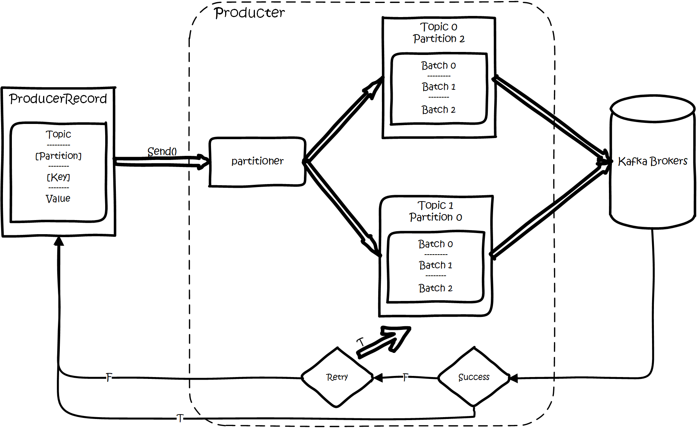

# 参考

- [震惊了！原来这才是kafka！](https://www.jianshu.com/p/d3e963ff8b70)

> `kafka`是一个分布式消息队列。具有高性能、持久化、多副本备份、横向扩展能力。
生产者往队列里写消息，消费者从队列里取消息进行业务逻辑。一般在架构设计中起到解耦、削峰、异步处理的作用。
>
> `kafka`对外使用`topic`的概念，生产者往`topic`里写消息，消费者从读消息。
为了做到水平扩展，一个`topic`实际是由多个`partition`组成的，遇到瓶颈时，可以通过增加partition的数量来进行横向扩容。单个`parition`内是保证消息有序。
>
> 每新写一条消息，`kafka`就是在对应的文件`append写`，所以性能非常高。

`kafka`的总体数据流是这样的：

大概用法就是，`Producers`往`Brokers`里面的指定`Topic`中写消息，`Consumers`从`Brokers`里面拉去指定`Topic`的消息，然后进行业务处理。

## 生产者

创建一条记录，记录中一个要指定对应的`topic`和`value`，key和partition可选。 先序列化，然后按照topic和partition，放进对应的发送队列中。

`kafka produce`都是批量请求，会积攒一批，然后一起发送，不是调send()就进行立刻进行网络发包。

## partition

当存在多副本的情况下，会尽量把多个副本，分配到不同的broker上。

kafka会为partition选出一个leader，之后所有该partition的请求，实际操作的都是leader，然后再同步到其他的follower。

当一个broker歇菜后，所有leader在该broker上的partition都会重新选举，选出一个leader。（这里不像分布式文件存储系统那样会自动进行复制保持副本数）
