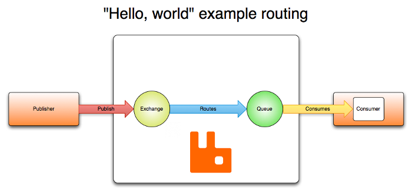
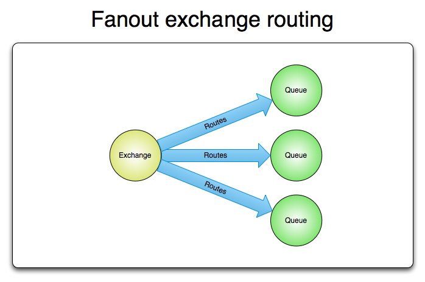

# AMQP是什么

AMQP（高级消息队列协议）是一个网络协议。它支持符合要求的客户端应用（application）和消息中间件代理（messaging middleware broker）之间进行通信。

## 消息代理和他们所扮演的角色

消息代理（message brokers）从发布者（publishers）亦称生产者（producers）那儿接收消息，并根据既定的路由规则把接收到的消息发送给处理消息的消费者（consumers）。

由于AMQP是一个网络协议，所以这个过程中的发布者，消费者，消息代理 可以存在于不同的设备上。

## AMQP 0-9-1 模型简介

AMQP 0-9-1的工作过程如下图：消息（message）被发布者（publisher）发送给交换机（exchange），交换机常常被比喻成邮局或者邮箱。然后交换机将收到的消息根据路由规则分发给绑定的队列（queue）。最后AMQP代理会将消息投递给订阅了此队列的消费者，或者消费者按照需求自行获取。

从安全角度考虑，网络是不可靠的，接收消息的应用也有可能在处理消息的时候失败。基于此原因，AMQP模块包含了一个消息确认（message acknowledgements）的概念：当一个消息从队列中投递给消费者后（consumer），消费者会通知一下消息代理（broker），这个可以是自动的也可以由处理消息的应用的开发者执行。当“消息确认”被启用的时候，消息代理不会完全将消息从队列中删除，直到它收到来自消费者的确认回执（acknowledgement）。

在某些情况下，例如当一个消息无法被成功路由时，消息或许会被返回给发布者并被丢弃。或者，如果消息代理执行了延期操作，消息会被放入一个所谓的死信队列中。此时，消息发布者可以选择某些参数来处理这些特殊情况。

## 交换机和交换机类型

交换机是用来发送消息的AMQP实体。交换机拿到一个消息之后将它路由给一个或零个队列。它使用哪种路由算法是由交换机类型和被称作绑定（bindings）的规则所决定的。AMQP 0-9-1的代理提供了四种交换机

|Name（交换机类型）|Default pre-declared names（预声明的默认名称）|
|-------------|-------------|
|Direct exchange（直连交换机）|(Empty string) and amq.direct|
|Fanout exchange（扇型交换机）|amq.fanout|
|Topic exchange（主题交换机）|amq.topic|
|Headers exchange（头交换机）|amq.match (and amq.headers in RabbitMQ)|

除交换机类型外，在声明交换机时还可以附带许多其他的属性，其中最重要的几个分别是：

- Name
- Durability （消息代理重启后，交换机是否还存在）
- Auto-delete （当所有与之绑定的消息队列都完成了对此交换机的使用后，删掉它）
- Arguments（依赖代理本身）

交换机可以有两个状态：持久（durable）、暂存（transient）。持久化的交换机会在消息代理（broker）重启后依旧存在，而暂存的交换机则不会（它们需要在代理再次上线后重新被声明）。然而并不是所有的应用场景都需要持久化的交换机。

### 默认交换机

默认交换机（`default exchange`）实际上是一个由消息代理预先声明好的没有名字（名字为空字符串）的直连交换机（`direct exchange`）。它有一个特殊的属性使得它对于简单应用特别有用处：那就是每个新建队列（queue）都会自动绑定到默认交换机上，绑定的路由键（routing key）名称与队列名称相同。

举个栗子：当你声明了一个名为"search-indexing-online"的队列，AMQP代理会自动将其绑定到默认交换机上，绑定（binding）的路由键名称也是为"search-indexing-online"。因此，当携带着名为"search-indexing-online"的路由键的消息被发送到默认交换机的时候，此消息会被默认交换机路由至名为"search-indexing-online"的队列中。换句话说，默认交换机看起来貌似能够直接将消息投递给队列，尽管技术上并没有做相关的操作。

## 直连交换机

直连型交换机（`direct exchange`）是根据消息携带的路由键（routing key）将消息投递给对应队列的。直连交换机用来处理消息的单播路由（unicast routing）（尽管它也可以处理多播路由）。下边介绍它是如何工作的：

- 将一个队列绑定到某个交换机上，同时赋予该绑定一个路由键（routing key）
- 当一个携带着路由键为R的消息被发送给直连交换机时，交换机会把它路由给绑定值同样为R的队列。

直连交换机经常用来循环分发任务给多个工作者（workers）。当这样做的时候，我们需要明白一点，在AMQP 0-9-1中，消息的负载均衡是发生在消费者（consumer）之间的，而不是队列（queue）之间。

## 扇型交换机

扇型交换机（`funout exchange`）将消息路由给绑定到它身上的所有队列，而不理会绑定的路由键。如果N个队列绑定到某个扇型交换机上，当有消息发送给此扇型交换机时，交换机会将消息的拷贝分别发送给这所有的N个队列。扇型用来交换机处理消息的广播路由（`broadcast routing`）。

因为扇型交换机投递消息的拷贝到所有绑定到它的队列，所以他的应用案例都极其相似：

- 大规模多用户在线（MMO）游戏可以使用它来处理排行榜更新等全局事件
- 体育新闻网站可以用它来近乎实时地将比分更新分发给移动客户端
- 分发系统使用它来广播各种状态和配置更新
- 在群聊的时候，它被用来分发消息给参与群聊的用户。（AMQP没有内置presence的概念，因此XMPP可能会是个更好的选择）

## 主题交换机

主题交换机（`topic exchanges`）通过对消息的路由键和队列到交换机的绑定模式之间的匹配，将消息路由给一个或多个队列。主题交换机经常用来实现各种分发/订阅模式及其变种。主题交换机通常用来实现消息的多播路由（`multicast routing`）。

主题交换机拥有非常广泛的用户案例。无论何时，当一个问题涉及到那些想要有针对性的选择需要接收消息的 多消费者/多应用（multiple consumers/applications） 的时候，主题交换机都可以被列入考虑范围。

使用案例：

- 分发有关于特定地理位置的数据，例如销售点
- 由多个工作者（workers）完成的后台任务，每个工作者负责处理某些特定的任务
- 股票价格更新（以及其他类型的金融数据更新）
- 涉及到分类或者标签的新闻更新（例如，针对特定的运动项目或者队伍）
- 云端的不同种类服务的协调
- 分布式架构/基于系统的软件封装，其中每个构建者仅能处理一个特定的架构或者系统
