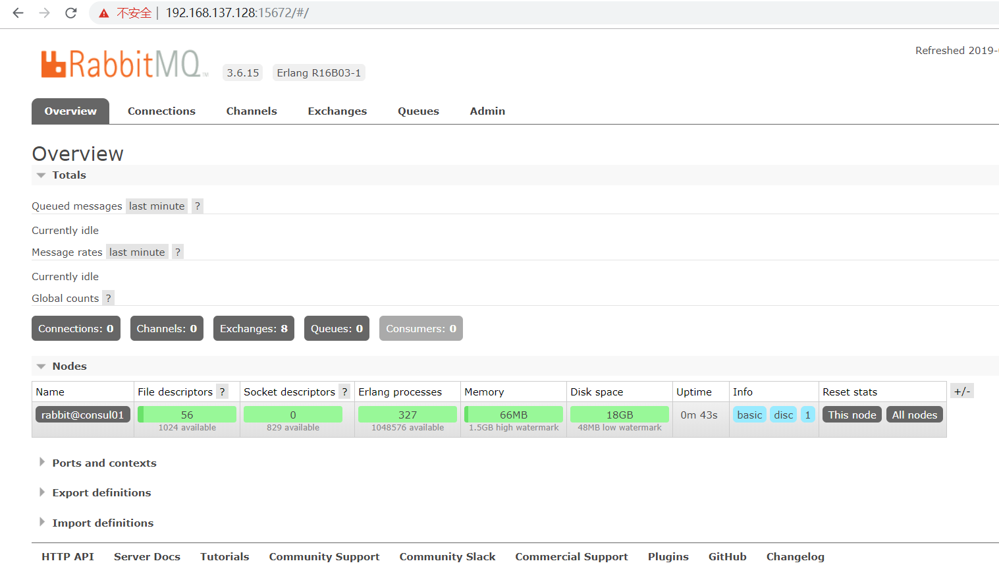

# rabbitmq简介

> RabbitMQ提供了多种技术可以让你在性能和可靠性之间进行权衡。这些技术包括持久性机制、投递确认、发布者证实和高可用性机制。
>
> 消息在到达队列前是通过交换机进行路由的。RabbitMQ为典型的路由逻辑提供了多种内置交换机类型。如果你有更复杂的路由需求，可以将这些交换机组合起来使用，你甚至可以实现自己的交换机类型，并且当做RabbitMQ的插件来使用。
>
> 在相同局域网中的多个RabbitMQ服务器可以聚合在一起，作为一个独立的逻辑代理来使用。

## 安装rabbitmq

```bash
mkdir rabbitmq && cd rabbitmq
wget https://www.rabbitmq.com/releases/erlang/erlang-19.0.4-1.el7.centos.x86_64.rpm
wget https://www.rabbitmq.com/releases/rabbitmq-server/v3.6.15/rabbitmq-server-3.6.15-1.el7.noarch.rpm

dnf install socat compat-openssl10 libnsl ncurses-compat -y
rpm -ivh erlang-19.0.4-1.el7.centos.x86_64.rpm
rpm -ivh rabbitmq-server-3.6.15-1.el7.noarch.rpm
```

## 启动rabbitmq

```bash
systemctl start rabbitmq-server.service
systemctl enable rabbitmq-server.service
systemctl status rabbitmq-server.service

```

## 查看rabbitmq状态

```bash
➜  rabbitmqctl status

Status of node rabbit@consul01
[{pid,18265},
 {running_applications,
     [{rabbit,"RabbitMQ","3.6.15"},
      {mnesia,"MNESIA  CXC 138 12","4.11"},
      {rabbit_common,
          "Modules shared by rabbitmq-server and rabbitmq-erlang-client",
          "3.6.15"},
      {recon,"Diagnostic tools for production use","2.3.2"},
      {os_mon,"CPO  CXC 138 46","2.2.14"},
      {ranch,"Socket acceptor pool for TCP protocols.","1.3.2"},
      {ssl,"Erlang/OTP SSL application","5.3.3"},
      {public_key,"Public key infrastructure","0.21"},
```

## 查看rabbitmq插件

```bash
➜  ~ rabbitmq-plugins list
 Configured: E = explicitly enabled; e = implicitly enabled
 | Status:   * = running on rabbit@consul01
 |/
[  ] amqp_client                       3.6.15
[  ] cowboy                            1.0.4
[  ] cowlib                            1.0.2
[  ] rabbitmq_amqp1_0                  3.6.15
[  ] rabbitmq_auth_backend_ldap        3.6.15
[  ] rabbitmq_auth_mechanism_ssl       3.6.15
[  ] rabbitmq_consistent_hash_exchange 3.6.15
[  ] rabbitmq_event_exchange           3.6.15
[  ] rabbitmq_federation               3.6.15
[  ] rabbitmq_federation_management    3.6.15
[  ] rabbitmq_jms_topic_exchange       3.6.15
[  ] rabbitmq_management               3.6.15
[  ] rabbitmq_management_agent         3.6.15
[  ] rabbitmq_management_visualiser    3.6.15
[  ] rabbitmq_mqtt                     3.6.15
[  ] rabbitmq_random_exchange          3.6.15
[  ] rabbitmq_recent_history_exchange  3.6.15
[  ] rabbitmq_sharding                 3.6.15
[  ] rabbitmq_shovel                   3.6.15
[  ] rabbitmq_shovel_management        3.6.15
[  ] rabbitmq_stomp                    3.6.15
[  ] rabbitmq_top                      3.6.15
[  ] rabbitmq_tracing                  3.6.15
[  ] rabbitmq_trust_store              3.6.15
[  ] rabbitmq_web_dispatch             3.6.15
[  ] rabbitmq_web_mqtt                 3.6.15
[  ] rabbitmq_web_mqtt_examples        3.6.15
[  ] rabbitmq_web_stomp                3.6.15
[  ] rabbitmq_web_stomp_examples       3.6.15
[  ] sockjs                            0.3.4
```

## 安装命令维护插件

```bash
➜  rabbitmq rabbitmq-plugins enable rabbitmq_management
The following plugins have been enabled:
  amqp_client
  cowlib
  cowboy
  rabbitmq_web_dispatch
  rabbitmq_management_agent
  rabbitmq_management

Applying plugin configuration to rabbit@consul01... started 6 plugins.
```

这个命令的作用是安装RabbitMq的一个管理插件，这样，我们就可以通过在浏览器访问 `http://ip:15672` 时，进入一个管理界面,默认用户名密码都是`guest`。

### 开放端口

```bash
# 15672: RabbitMQ 的 Web 管理界面端口
➜  rabbitmq firewall-cmd --zone=public --add-port=15672/tcp --permanent
success
# 5672, 5671: AMQP协议端口
➜  rabbitmq firewall-cmd --zone=public --add-port=5672/tcp --permanent
success
➜  rabbitmq firewall-cmd --zone=public --add-port=5671/tcp --permanent
success
# 重新载入防火墙配置，当前连接不中断
➜  rabbitmq firewall-cmd --reload
success
```


```bash
➜  rabbitmq cd /etc/rabbitmq
➜  rabbitmq cp /usr/share/doc/rabbitmq-server-3.6.15/rabbitmq.config.example /etc/rabbitmq/rabbitmq.config
➜  rabbitmq vi rabbitmq.config
```

```conf
%% The default "guest" user is only permitted to access the server
%% via a loopback interface (e.g. localhost).
%% {loopback_users, [<<"guest">>]},
%%
%% Uncomment the following line if you want to allow access to the
%% guest user from anywhere on the network.
%% {loopback_users, []},
# 取消%%注释和后面的逗号,
{loopback_users, []}
```

### 重启rabbitmq

```bash
➜  rabbitmq systemctl restart rabbitmq-server.service
```


