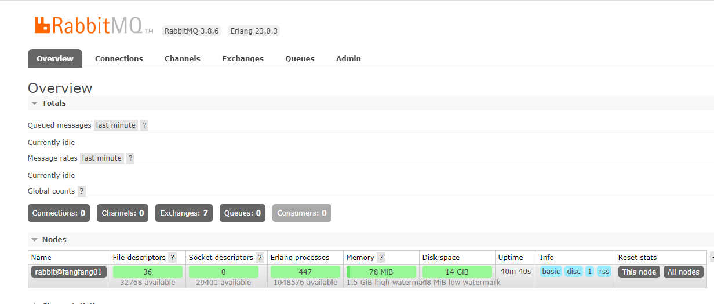

# rabbitmq升级

- [https://github.com/rabbitmq/rabbitmq-server](https://github.com/rabbitmq/rabbitmq-server)
- [https://github.com/rabbitmq/erlang-rpm/releases](https://github.com/rabbitmq/erlang-rpm/releases)
- [https://www.erlang-solutions.com/resources/download.html](https://www.erlang-solutions.com/resources/download.html)
- [https://dl.bintray.com/rabbitmq/all/rabbitmq-server](https://dl.bintray.com/rabbitmq/all/rabbitmq-server)

官网下载的安装包比较旧,需要到github下载最新的安装包

## 卸载rabbitmq和erlang

```bash
yum remove rabbitmq-server
yum remove erlang
yum remove erlang-erts.x86_64
```

### 查看centOS版本

```bash
➜  ~ cat /proc/version
Linux version 3.10.0-1127.13.1.el7.x86_64 (mockbuild@kbuilder.bsys.centos.org) (gcc version 4.8.5 20150623 (Red Hat 4.8.5-39) (GCC) ) #1 SMP Tue Jun 23 15:46:38 UTC 2020
➜  ~ uname -a
Linux fangfang01 3.10.0-1127.13.1.el7.x86_64 #1 SMP Tue Jun 23 15:46:38 UTC 2020 x86_64 x86_64 x86_64 GNU/Linux
```

## 安装新版本`RabbitMQ 3.8.6`

[RabbitMQ对应Erlang版本](https://www.rabbitmq.com/which-erlang.html)需要Erlang/OTP(22.3 or 23.0)

```bash
# 安装新版本[Erlang]
➜  ~ wget https://packages.erlang-solutions.com/erlang/rpm/centos/7/x86_64/esl-erlang_23.0.3-1\~centos\~7_amd64.rpm
➜  ~ rpm -ivh esl-erlang_23.0.3-1\~centos\~7_amd64.rpm
警告：esl-erlang_23.0.3-1~centos~7_amd64.rpm: 头V4 RSA/SHA256 Signature, 密钥 ID a14f4fca: NOKEY
准备中...                          ################################# [100%]
正在升级/安装...
   1:esl-erlang-23.0.3-1              ################################# [100%]
Erlang OTP 23.0.3 installed
# https://dl.bintray.com/rabbitmq/all/rabbitmq-server/3.8.6/
# 下载rabbitmq-server-3.8.6-1.el7.noarch.rpm上传到服务器
➜  ~ rpm -ivh rabbitmq-server-3.8.6-1.el7.noarch.rpm
警告：rabbitmq-server-3.8.6-1.el7.noarch.rpm: 头V4 RSA/SHA256 Signature, 密钥 ID 6026dfca: NOKEY
准备中...                          ################################# [100%]
正在升级/安装...
   1:rabbitmq-server-3.8.6-1.el7      ################################# [100%]
```

## 启动rabbitmq

```bash
systemctl start rabbitmq-server.service
systemctl enable rabbitmq-server.service
systemctl status rabbitmq-server.service
```

## 查看rabbitmq状态

```bash
➜  ~ rabbitmqctl status
Status of node rabbit@fangfang01 ...
Runtime

OS PID: 27422
OS: Linux
Uptime (seconds): 25
RabbitMQ version: 3.8.6
Node name: rabbit@fangfang01
Erlang configuration: Erlang/OTP 23 [erts-11.0.3] [source] [64-bit] [smp:4:4] [ds:4:4:10] [async-threads:64] [hipe]
Erlang processes: 280 used, 1048576 limit
Scheduler run queue: 1
Cluster heartbeat timeout (net_ticktime): 60

Plugins

Enabled plugin file: /etc/rabbitmq/enabled_plugins
Enabled plugins:


Data directory

Node data directory: /var/lib/rabbitmq/mnesia/rabbit@fangfang01
Raft data directory: /var/lib/rabbitmq/mnesia/rabbit@fangfang01/quorum/rabbit@fangfang01
```

## 安装命令维护插件

```bash
➜  ~ rabbitmq-plugins enable rabbitmq_management
Enabling plugins on node rabbit@fangfang01:
rabbitmq_management
The following plugins have been configured:
  rabbitmq_management
  rabbitmq_management_agent
  rabbitmq_web_dispatch
Applying plugin configuration to rabbit@fangfang01...
The following plugins have been enabled:
  rabbitmq_management
  rabbitmq_management_agent
  rabbitmq_web_dispatch

started 3 plugins.
```

这个命令的作用是安装RabbitMq的一个管理插件，这样，我们就可以通过在浏览器访问 `http://ip:15672` 时，进入一个管理界面,默认用户名密码都是`guest`。

### 开放端口

```bash
# 15672: RabbitMQ 的 Web 管理界面端口
➜  ~ firewall-cmd --zone=public --add-port=15672/tcp --permanent
success
# 5672, 5671: AMQP协议端口
➜  ~ firewall-cmd --zone=public --add-port=5672/tcp --permanent
success
➜  ~ firewall-cmd --zone=public --add-port=5671/tcp --permanent
success
# 重新载入防火墙配置，当前连接不中断
➜  ~ firewall-cmd --reload
success
```

### 创建用户

guest账号只能在本机登录。这里就不去修改相应配置了，而是另外创建其他登录账号。

```bash
# 创建用户名admin，密码aaaaaa的用户
rabbitmqctl add_user admin 123456
# 设置admin为超级管理员
rabbitmqctl set_user_tags admin administrator
# 授权远程访问（也可以登录后，可视化配置）
rabbitmqctl set_permissions -p / admin "." "." ".*"
# 创建完成后，重启RabbitMQ
systemctl restart rabbitmq-server
```


