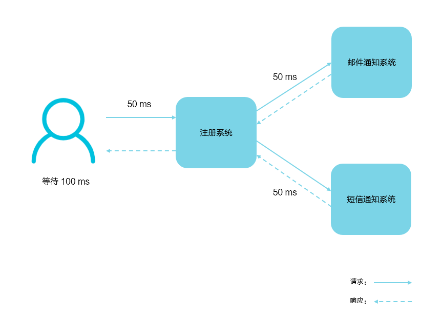
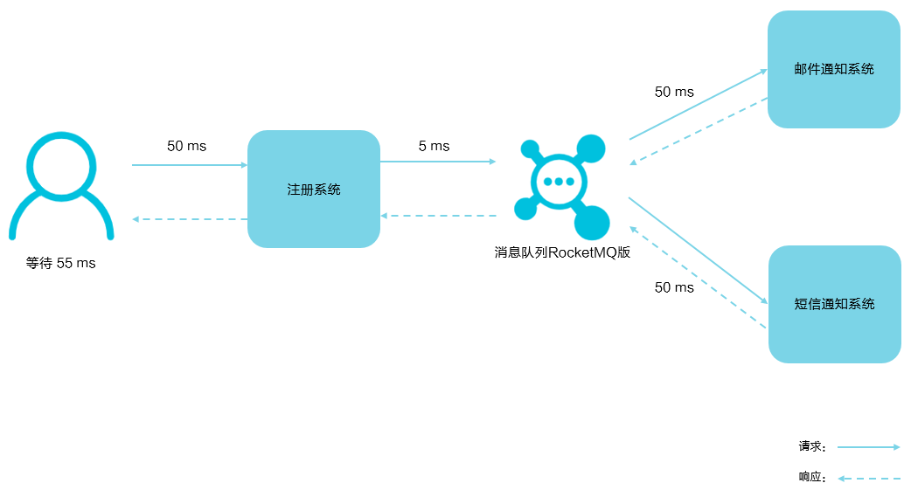
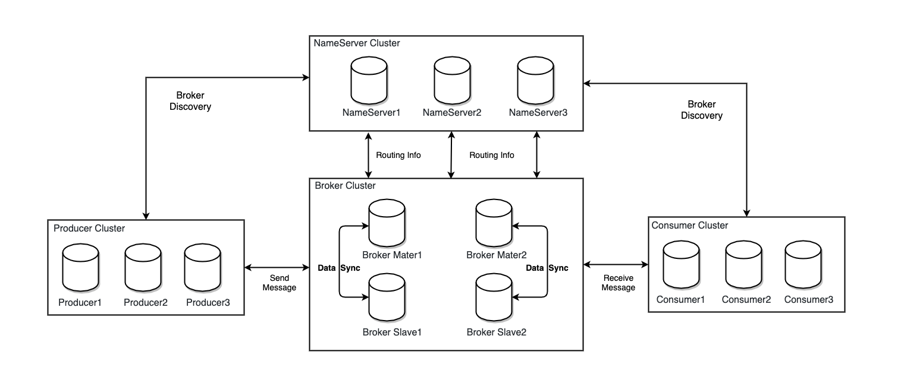
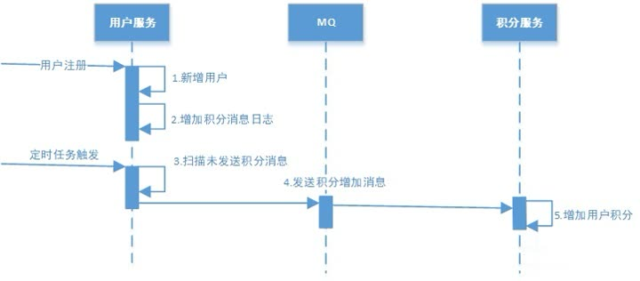
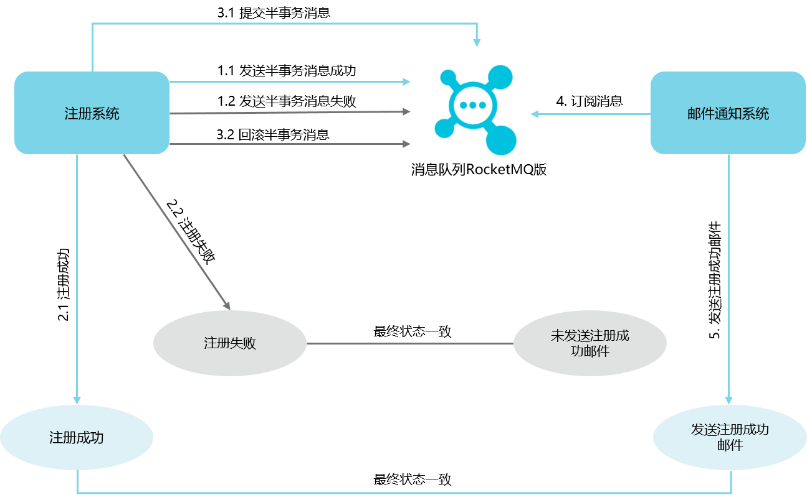

[TOC]

## 消息队列介绍

最常见的一个场景是用户注册后，需要发送注册邮件和短信通知，以告知用户注册成功。



假设每个任务耗时分别为50 ms，其中，邮件和短信通知并行完成，则用户需要在注册页面等待总共100 ms才能登录。



用户只需在注册页面等待注册数据写入注册系统和消息队列RocketMQ的时间，即等待55 ms即可登录。

异步解耦是消息队列的主要特点，主要目的是减少请求响应时间和解耦。

## rocketmq 简介

`RocketMQ`是一个纯 Java、分布式、队列模型的开源消息中间件。
前身是`MetaQ`，是阿里参考`Kafka`特点研发的一个队列模型的消息中间件。
后开源给 apache 基金会成为了 apache 的顶级开源项目，具有高性能、高可靠、高实时、分布式特点。

**2011年**：业界出现了现在被很多大数据领域所推崇的Kafka消息引擎，阿里巴巴在研究了Kafka的整体机制和架构设计之后，基于Kafka的设计使用Java进行了完全重写并推出了**MetaQ 1.0**版本，主要是用于解决顺序消息和海量堆积的问题。

**2012年**：阿里巴巴开源其自研的第三代分布式消息中间件——**RocketMQ**。

经过几年的技术打磨，阿里称基于RocketMQ技术，目前双十一当天消息容量可达到万亿级。

**2016年11月**：阿里将RocketMQ捐献给**Apache**软件基金会，正式成为孵化项目。

**RocketMQ天生为金融互联网领域而生**，追求高可靠、高可用、高并发、低延迟。

**RocketMQ**在阿里集团也被广泛应用在订单，交易，充值，流计算，消息推送，日志流式处理，**binglog**分发等场景。

## rocketmq架构




`RocketMQ`架构上主要分为四部分，如上图所示:

- `NameServer`：NameServer 是一个非常简单的 Topic 路由注册中心，支持 Broker 的动态注册与发现,节点之间无任何信息同步,类似 eureka 注册中心。
- `Producer`：消息发布的角色，支持分布式集群方式部署。
- - `Producer`与`NameServer`集群中的其中一个节点（随机选择）建立长连接，定期从NameServer获取Topic路由信息

  - 向提供`Topic`服务的`Master Broker`建立长连接，且定时向`Master Broker`发送心跳。Producer完全无状态，可集群部署。
- `Consumer`：消息消费的角色，支持分布式集群方式部署。
- - `Consumer`与`NameServer`集群中的其中一个节点（随机选择）建立长连接，定期从NameServer获取Topic路由信息
  - 向提供`Topic`服务的`Master`、`Slave`建立长连接，且定时向`Master`、`Slave`发送心跳。`Consumer`既可以从`Master`订阅消息，也可以从`Slave`订阅消息
  - 支持以 `push、pull`两种模式对消息进行消费。同时也支持集群方式和广播方式的消费，它提供实时消息订阅机制，可以满足大多数用户的需求。
  - `push消息`，应用通常主动调用Consumer的拉消息方法`从Broker服务器拉消息`、主动权由应用控制。
  - `pull消息`，该模式下`Broker`收到数据后会`主动推送给消费端`，该消费模式一般实时性较高
  - `集群消费模式`,相同`Consumer Group`的每个Consumer实例`平均分摊消息`。
  - `广播消费模式`,相同`Consumer Group`的每个Consumer实例都`接收全量的消息`。
- `BrokerServer`：Broker 主要负责消息的存储、投递和查询以及服务高可用保证

## rocketmq特性

### **消息过滤**
RocketMQ的消费者可以根据**Tag**进行消息过滤，也支持自定义属性过滤。**消息过滤目前是在Broker端实现的**，优点是减少了对于Consumer无用消息的网络传输，缺点是增加了Broker的负担。

**到底什么时候该用Topic，什么时候该用Tag**

建议您从以下几个方面进行判断：

- 消息类型是否一致：如普通消息、事务消息、定时（延时）消息、顺序消息，不同的消息类型使用不同的Topic，无法通过Tag进行区分。
- 业务是否相关联：没有直接关联的消息，如淘宝交易消息，京东物流消息使用不同的Topic进行区分；而同样是天猫交易消息，电器类订单、女装类订单、化妆品类订单的消息可以用Tag进行区分。
- 消息优先级是否一致：如同样是物流消息，盒马必须小时内送达，天猫超市24小时内送达，淘宝物流则相对会慢一些，不同优先级的消息用不同的Topic进行区分。
- 消息量级是否相当：有些业务消息虽然量小但是实时性要求高，如果跟某些万亿量级的消息使用同一个Topic，则有可能会因为过长的等待时间而“饿死”，此时需要将不同量级的消息进行拆分，使用不同的Topic。

### **定时消息**

定时消息是指消息发到 Broker 后，不能立刻被 Consumer 消费，要到特定的时间点或者等待特定的时间后才能被消费。

```text
固定精度：
1s 5s 10s 30s 1m 2m 3m 4m 5m 6m 7m 8m 9m 10m 20m 30m 1h 2h
org.apache.rocketmq.store.config.MessageStoreConfig#messageDelayLevel
```

### 内置的消息跟踪功能

消息队列RocketMQ版提供了三种消息查询的方式，分别是按**Message ID**、**Message Key**以及**Topic**查询。

通过消息轨迹，能清晰定位消息从生产者发出，经由消息队列RocketMQ版服务端，投递给消息消费者的完整链路，方便定位排查问题。

### 按时间或偏移量追溯消息

rocketmq支持按时间或偏移量追溯消息

`broker.conf`添加配置开启消息轨迹,**traceTopicEnable=true**

### 消息重试

- 同步发送消息失败，通过**retryTimesWhenSendFailed**设置重试次数，默认为2次
- 异步发送消息是吧，通过**retryTimesWhenSendAsyncFailed**设置重试次数，默认0次

### 消息特性

消息领域有一个对消息投递的QoS定义，分为：

- 最多一次（At most once）
- 至少一次（At least once）
- 仅一次（ Exactly once）

> QoS：Quality of Service，服务质量

几乎所有的MQ产品都声称自己做到了**At least once**。

既然是至少一次，那避免不了消息重复，尤其是在分布式网络环境下。

比如：网络原因闪断，ACK返回失败等等故障，确认信息没有传送到消息队列，导致消息队列不知道自己已经消费过该消息了，再次将该消息分发给其他的消费者。

不同的消息队列发送的确认信息形式不同，例如**RabbitMQ**是发送一个ACK确认消息，**RocketMQ**是返回一个CONSUME_SUCCESS成功标志。

## 分布式事务消息

### 本地事务与消息发送的原子性问题

本地事务与消息发送的原子性问题即：事务发起方在本地事务执行成功后消息必须发出去，否则就丢弃消息。即实现本地事务和消息发送的原子性，要么都成功，要么都失败。

先来尝试下这种操作，先发送消息，再操作数据库：

```text
begin transaction；
	//1.发送MQ
	//2.数据库操作
commit transation;
```

这种情况下无法保证数据库操作与发送消息的一致性，因为可能发送消息成功，数据库操作失败。

你立马想到第二种方案，先进行数据库操作，再发送消息：

```text
begin transaction；
	//1.数据库操作
	//2.发送MQ
commit transation;
```

 这种情况下貌似没有问题，如果发送MQ消息失败，就会抛出异常，导致数据库事务回滚。

- 发送mq消息后服务宕机或者重启，消息发送成功但是本地事务没有被提交。
- 需要发送多个不同消息的场景，无法确认第一个消息发送完，后面的

- 超时异常，数据库回滚，但MQ其实已经正常发送了，同样会导致不一致。

### 本地消息表方案

 本地消息表这个方案最初是eBay提出的，此方案的核心是通过本地事务保证数据业务操作和消息的一致性，然后通过定时任务将消息发送至消息中间件，待确认消息发送给消费方成功再将消息删除。

下面以注册送积分为例来说明：

下例共有两个微服务交互，用户服务和积分服务，用户服务负责添加用户，积分服务负责增加积分。



**1）用户注册**

 用户服务在本地事务新增用户和增加 ”积分消息日志“。（用户表和消息表通过本地事务保证一致）

下边是伪代码

```text
begin transaction；
	//1.新增用户
	//2.存储积分消息日志
commit transation;
```

这种情况下，本地数据库操作与存储积分消息日志处于同一个事务中，本地数据库操作与记录消息日志操作具备原子性。

**2）定时任务扫描日志**

 如何保证将消息发送给消息队列呢？

 经过第一步消息已经写到消息日志表中，可以启动独立的线程，定时对消息日志表中的消息进行扫描并发送至消息中间件，在消息中间件反馈发送成功后删除该消息日志，否则等待定时任务下一周期重试。

### RocketMQ事务消息方案

 在RocketMQ 4.3后实现了完整的事务消息，实际上其实是对本地消息表的一个封装，将本地消息表移动到了MQ内部，解决 Producer 端的消息发送与本地事务执行的原子性问题。




上图说明了事务消息的大致方案，其中分为两个流程：正常事务消息的发送及提交、事务消息的补偿流程。

1.事务消息发送及提交：

(1) 发送消息（half消息）。

(2) 服务端响应消息写入结果。

(3) 根据发送结果执行本地事务（如果写入失败，此时half消息对业务不可见，本地逻辑不执行）。

(4) 根据本地事务状态执行Commit或者Rollback（Commit操作生成消息索引，消息对消费者可见）

2.补偿流程：

(1) 对没有Commit/Rollback的事务消息（pending状态的消息），从服务端发起一次“回查”

(2) Producer收到回查消息，检查回查消息对应的本地事务的状态

(3) 根据本地事务状态，重新Commit或者Rollback

其中，补偿阶段用于解决消息Commit或者Rollback发生超时或者失败的情况。

## 参考

- [https://rocketmq.apache.org/docs/quick-start/](https://rocketmq.apache.org/docs/quick-start/)
- [rocketmq设计](https://github.com/apache/rocketmq/blob/master/docs/cn/design.md)
- [Kafka和RocketMQ底层存储之那些你不知道的事](https://zhuanlan.zhihu.com/p/163759210)
- [SpringCloud集成RocketMQ实现可靠消息最终一致性分布式事务方案](https://zhuanlan.zhihu.com/p/136698297)
- [Kafka 和 RocketMQ 底层存储之那些你不知道的事](https://blog.csdn.net/csdnnews/article/details/107625269)
- [什么是mmap](https://cloud.tencent.com/developer/article/1805566)
- [揭秘：Kafka与RocketMQ性能对比](https://zhuanlan.zhihu.com/p/326878232)
- [kafka与Rocketmq的区别](https://www.cnblogs.com/ynyhl/p/11320797.html)
