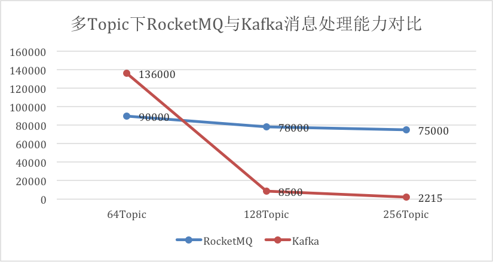
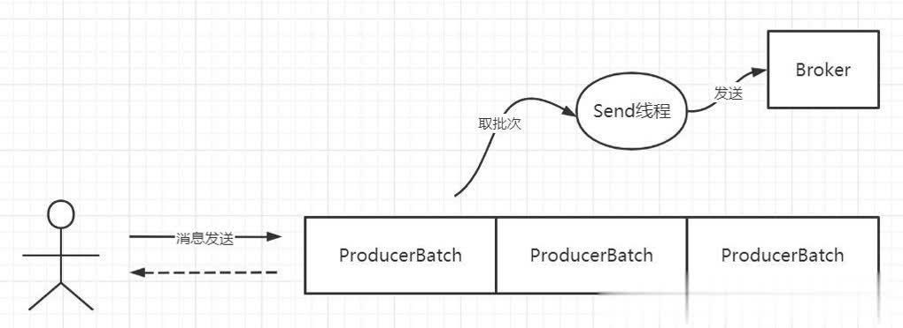

## rocketmq和kafka比较

### 1. 单机性能测试

默认每个Topic的分区数为8，每个Topic对应一个订阅者，逐步增加Topic数量。

### 2. 消息存储

- Kafka 中文件的布局是以**` Topic/partition`** ，每一个分区一个物理文件夹，在**分区文件级别实现文件顺序写**，如果一个Kafka集群中拥有成百上千个主题，每一个主题拥有上百个分区，消息在高并发写入时，其IO操作就会显得零散，其操作相当于随机IO，**即 Kafka 在消息写入时的IO性能会随着 topic 、分区数量的增长，其写入性能会先上升，然后下降**。

- RocketMQ在消息写入时追求极致的顺序写，所有的消息不分主题一律顺序写入**commitlog** 文件，并**不会随着 topic 和 分区数量的增加而影响其顺序性**。

- Kafka 的 topic 扩容分区会涉及分区在各个 Broker 的移动，其**扩容操作比较重**

- 而 RocketMQ 数据存储是基于 **commitlog** 文件的，扩容时不会产生数据移动，只会对新的数据产生影响。

  #### 2.1 rocket所有的消息一律顺序写入**commitlog** 文件,那读取会慢吗

  rocketmq写入和读取消息都是基于**mmap+write**，只要没用大量消息堆积，所有消费者读取的消息都基本在同一个1G大小的commitLog文件中，通过消息位移读取消息，并不会产生随机IO。

  但是有大量消息堆积，并且各个消费者消息都在不同的commitLog文件中，回产生随机IO，所以要加大消费者消息力度避免消息堆积的情况。

### 3. 消息发送方式

#### 3.1 kafka消息发送方式

Kafka 在消息发送客户端采用了一个双端队列，引入了批处理思想，其消息发送机制如下图所示

客户端通过调用 kafka 的消息发送者发送消息时，消息会首先**缓存到消息累加器RecordAccumulator(数据结构为双端队列)**中,消息累加器受参数**buffer.memory**控制默认32M，双端队列中单个元素为 ProducerBatch，表示一个发送批次，其最大大小受参数 **batch.size** 控制，默认为 16K。然后会单独开一个 Send 线程，从双端队列中获取一个发送批次，将消息按批发送到 Kafka集群中，这里引入了**linger.ms** 参数来控制 Send 线程的发送行为。

为了提高 kafka 消息发送的高吞吐量，即控制在缓存区中未积满**batch.size** 时来控制消息发送线程的行为，是立即发送还是等待一定时间，如果**linger.ms 设置为 0表示立即发送**，如果设置为大于0，则消息发送线程会等待这个值后才会向broker发送。 **linger.ms 参数者会增加响应时间，但有利于增加吞吐量。**

Kafka 的消息发送，在写入ProducerBatch时会按照消息存储协议组织好数据，在服务端可以直接写入到文件中。

#### 3.2 rocketmq消息发送方式

RocketMQ 消息发送在客户端主要是根据路由选择算法选择一个队列，然后将消息发送到服务端，消息会在服务端按照消息的存储格式进行组织，然后进行持久化等操作。

#### 3.3 消息发送对比

Kafka 在消息发送方面比 RokcetMQ 有一个显著的优势就是消息格式的组织是发生在客户端，这样会有一个大的优势节约了 Broker 端的CPU压力

Kafka 在消息发送端另外一个特点是引入了双端缓存队列，Kafka 无处不在追求批处理，这样显著的特点是能**提高消息发送的吞吐量，但与之带来的是增大消息的响应时间**，并且带来了消息丢失的可能性(可以通过`ack=all`避免)，因为 Kafka 追加到消息缓存后会返回成功，如果消息发送方异常退出，会带来消息丢失。

Kafka 中的 linger.ms = 0 可类比 RocketMQ 消息发送的效果。

但 Kafka 通过提供 `batch.size` 与 `linger.ms` 两个参数按照场景进行定制化，比 RocketMQ 灵活。

例如日志集群，通常会调大 batch.size 与 linger.ms 参数，发挥消息批量发送机制，提高其吞吐量；但如果对一些响应时间比较敏感的话，可以适当减少 linger.ms 的值。

### 4. 消息消费

- kafka当消费者拉取到了分区的某个消息之后，`消费者会自动提交了offset`。自动提交的话会有一个问题，试想一下，当消费者刚拿到这个消息准备进行真正消费的时候，突然挂掉了，消息实际上并没有被消费，但是 offset 却被自动提交了。
解决办法也比较粗暴，我们`手动关闭自动提交 offset，每次在真正消费完消息之后之后再自己手动提交 offset 。`

### 4.消费并行度

- Kafka的消费并行度依赖Topic配置的分区数，如分区数为10，那么最多10台机器来并行消费（每台机器只能开启一个线程），或者一台机器消费（10个线程并行消费）。即消费并行度和分区数一致。
- RocketMQ消费并行度分两种情况
  - 顺序消费方式并行度同Kafka完全一致
  - 乱序方式并行度取决于Consumer的线程数，如Topic配置10个队列，10台机器消费，每台机器100个线程，那么并行度为1000。

## 参考

- [https://rocketmq.apache.org/docs/quick-start/](https://rocketmq.apache.org/docs/quick-start/)
- [rocketmq设计](https://github.com/apache/rocketmq/blob/master/docs/cn/design.md)
- [Kafka和RocketMQ底层存储之那些你不知道的事](https://zhuanlan.zhihu.com/p/163759210)
- [SpringCloud集成RocketMQ实现可靠消息最终一致性分布式事务方案](https://zhuanlan.zhihu.com/p/136698297)
- [Kafka 和 RocketMQ 底层存储之那些你不知道的事](https://blog.csdn.net/csdnnews/article/details/107625269)
- [什么是mmap](https://cloud.tencent.com/developer/article/1805566)
- [揭秘：Kafka与RocketMQ性能对比](https://zhuanlan.zhihu.com/p/326878232)
- [kafka与Rocketmq的区别](https://www.cnblogs.com/ynyhl/p/11320797.html)
