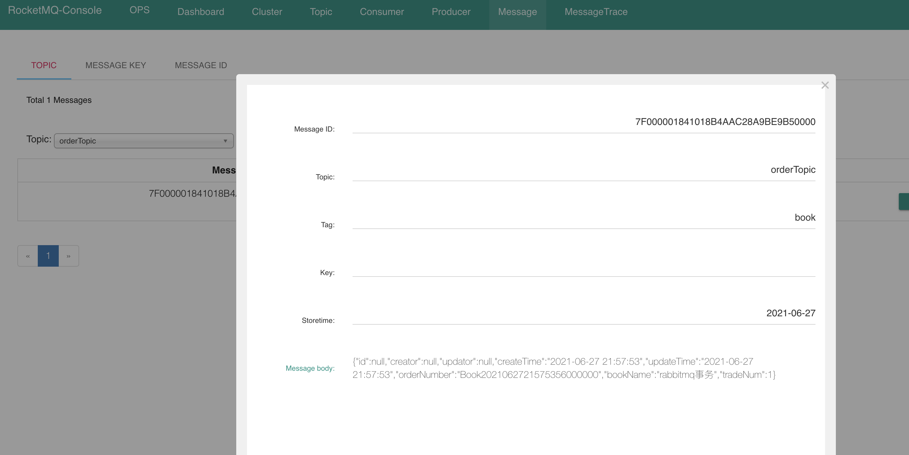

# `rocketmq`控制界面

- [https://rocketmq-1.gitbook.io/rocketmq-connector/](https://rocketmq-1.gitbook.io/rocketmq-connector/)
- [https://github.com/apache/rocketmq-externals](https://github.com/apache/rocketmq-externals)

`RocketMQ`有一个对其扩展的开源项目[incubator-rocketmq-externals](https://github.com/apache/rocketmq-externals)，这个项目中有一个子模块叫`rocketmq-console`，这个便是管理控制台项目了。项目下载地址：`https://github.com/apache/rocketmq-externals`。

```bash
git clone https://gitee.com/mirrors/RocketMQ-Externals.git
cd RocketMQ-Externals
cd rocketmq-console
# 打包
mvn clean package -Dmaven.test.skip=true

java -jar target/rocketmq-console-ng-2.0.0.jar --server.port=12581 --rocketmq.config.namesrvAddr=127.0.0.1:9876
# 打开
127.0.0.1:12581
```

## 根据偏移查看消息

```bash
➜  bin ./mqadmin queryMsgByOffset --brokerName chenjianhuadeMacBook-Pro.local --queueId 4  --offset 0  --topic orderTopic --namesrvAddr 127.0.0.1:9876
OffsetID:            C0A8016500002A9F0000000000036768
Topic:               orderTopic
Tags:                [book]
Keys:                [null]
Queue ID:            4
Queue Offset:        0
CommitLog Offset:    223080
Reconsume Times:     0
Born Timestamp:      2021-06-27 21:57:53,726
Store Timestamp:     2021-06-27 21:57:53,774
Born Host:           192.168.1.101:56242
Store Host:          192.168.1.101:10911
System Flag:         0
Properties:          {MIN_OFFSET=0, MAX_OFFSET=1, UNIQ_KEY=7F000001841018B4AAC28A9BE9B50000, CLUSTER=DefaultCluster, WAIT=true, TAGS=book}
Message Body Path:   /tmp/rocketmq/msgbodys/7F000001841018B4AAC28A9BE9B50000
```


