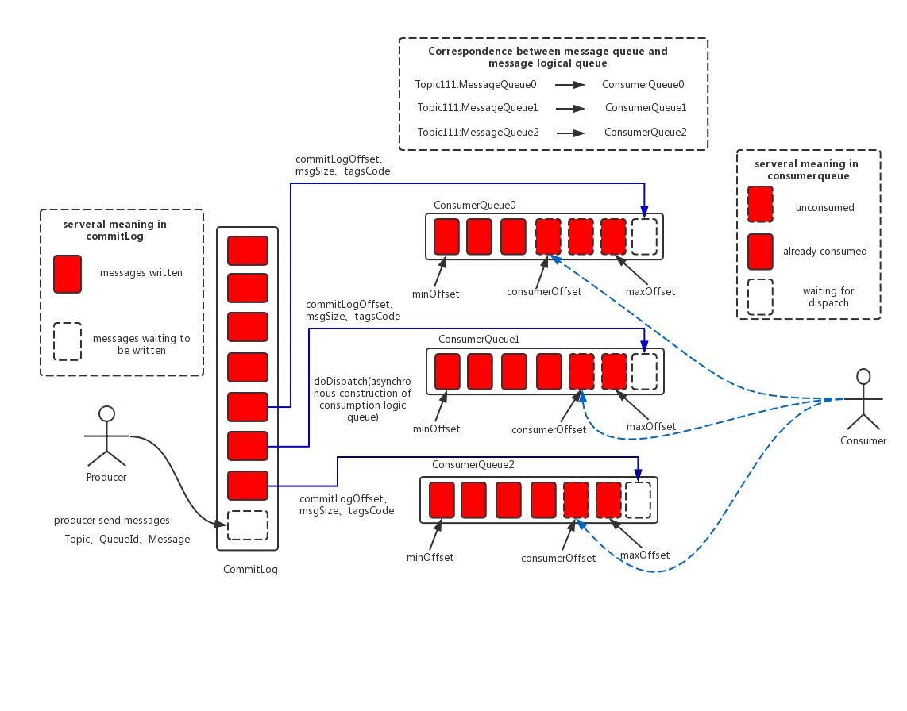

## 消息存储

### rocketmq消息存储


RocketMQ存储路径默认是`${user.home}/store`

```
➜  store ls 
abort        commitlog    consumequeue lock
checkpoint   config       index
```

- **commitlog消息主体以及元数据的存储主体**，存储Producer端写入的消息主体内容,消息内容不是定长的。**单个文件大小默认1G ，文件名长度为20位，左边补零，剩余为起始偏移量**，比如`00000000000000000000`代表了第一个文件，起始偏移量为0，文件大小为1G=1073741824；当第一个文件写满了，第二个文件为`00000000001073741824`，起始偏移量为1073741824，以此类推。消息主要是顺序写入日志文件，当文件满了，写入下一个文件
- **consumequeue消息消费队列**，引入的目的主要是提高消息消费的性能，由于RocketMQ是基于主题topic的订阅模式，消息消费是针对主题进行的，如果要遍历commitlog文件中根据topic检索消息是非常低效的。**Consumer即可根据ConsumeQueue来查找待消费的消息。**其中，ConsumeQueue（逻辑消费队列）作为消费消息的索引，**保存了指定Topic下的队列消息在CommitLog中的起始物理偏移量offset，消息大小size和消息Tag的HashCode值。**consumequeue文件可以看成是基于topic的commitlog索引文件，故consumequeue文件夹的组织方式如下：topic/queue/file三层组织结构，具体存储路径为：`$HOME/store/consumequeue/{topic}/{queueId}/{fileName}`。**同样consumequeue文件采取定长设计**，每一个条目共20个字节，分别为8字节的commitlog物理偏移量、4字节的消息长度、8字节tag hashcode，单个文件由30W个条目组成，可以像数组一样随机访问每一个条目，每个ConsumeQueue文件大小约5.72M；
-  **index(索引文件)提供了一种可以通过key或时间区间来查询消息的方法。**Index文件的存储位置是：`$HOME \store\index\${fileName}`，文件名fileName是以创建时的时间戳命名的，固定的单个IndexFile文件大小约为400M，一个IndexFile可以保存 2000W个索引，IndexFile的底层存储设计为在文件系统中实现HashMap结构，故rocketmq的索引文件其底层实现为hash索引。


ConsumeQueue存储格式的特性，保证了写过程的顺序写盘（写CommitLog文件），大量数据IO都在顺序写同一个commitLog，满1G了再写新的。加上rocketmq是累计4K才强制从PageCache中刷到磁盘（缓存），所以高并发写性能突出。

### kafka消息存储

Kafka 的日志存储和 RocketMQ 不一样，它是一个分区一个文件。


