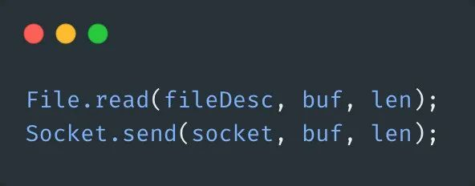
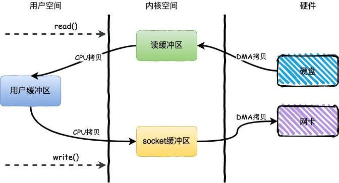
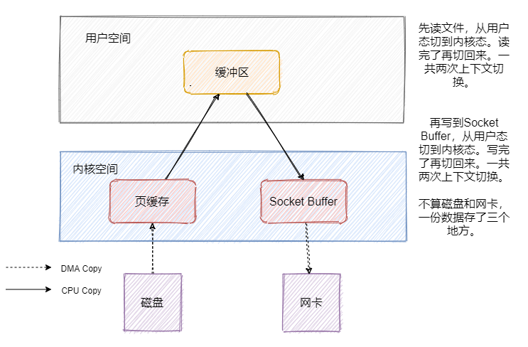
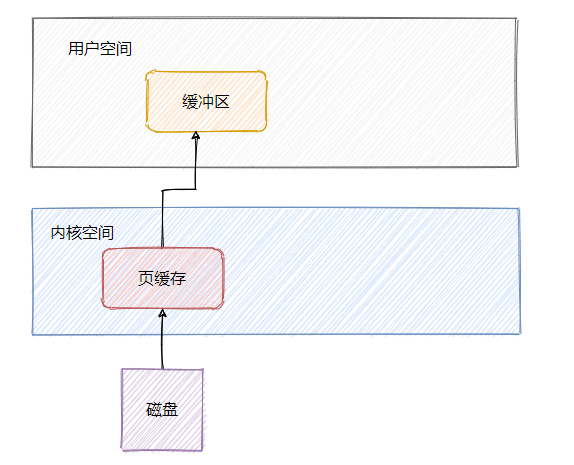
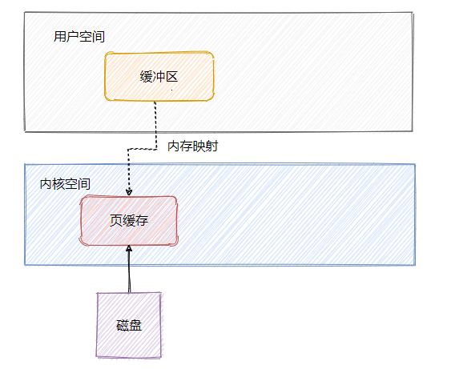
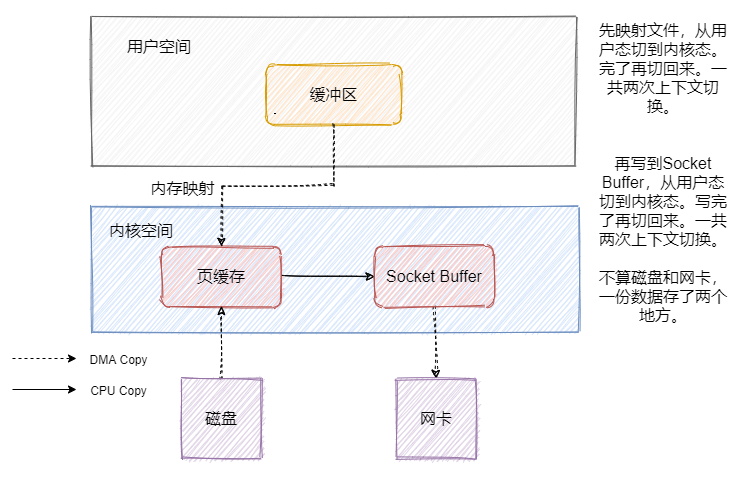
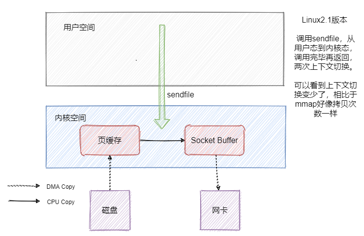
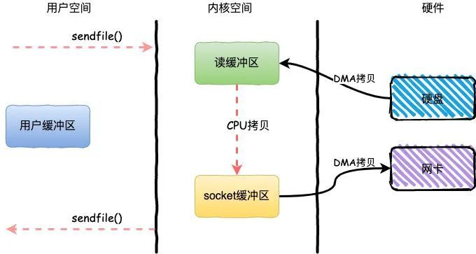
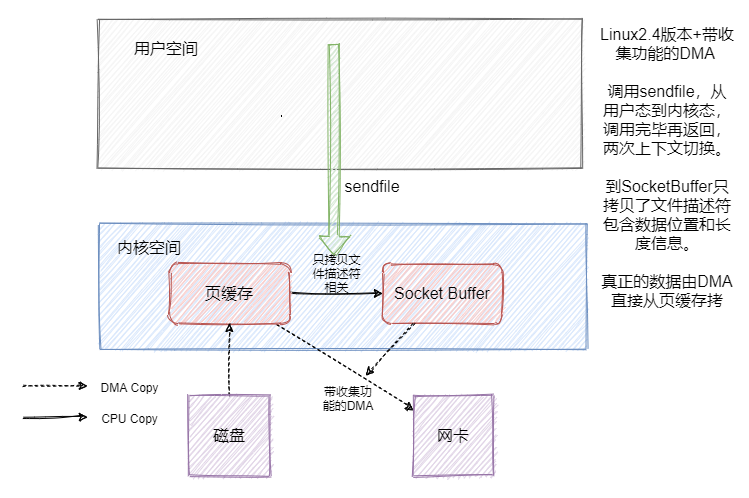
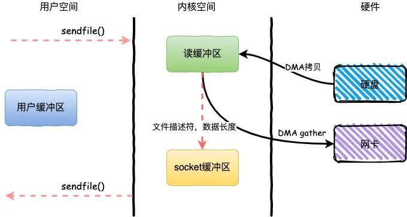

## **零拷贝**

> 零拷贝技术是指计算机执行操作时，CPU不需要先将数据从某处内存复制到另一个特定区域，这种技术通常用于通过网络传输文件时节省CPU周期和内存带宽。

### **传统IO read+write**

既然消息是存在磁盘中的，那消费者来拉消息的时候就得从磁盘拿。我们先来看看一般发送文件的流程是如何的。

基于传统的IO方式，底层实际上通过调用`read()`和`write()`来实现。

通过`read()`把数据从硬盘读取到内核缓冲区，再复制到用户缓冲区；然后再通过`write()`写入到`socket缓冲区`，最后写入网卡设备。

整个过程发生了**4次用户态和内核态的上下文切换**和**4次拷贝**，具体流程如下：

1. 用户进程通过`read()`方法向操作系统发起调用，此时上下文从用户态转向内核态
2. DMA控制器把数据从硬盘中拷贝到读缓冲区
3. CPU把读缓冲区数据拷贝到应用缓冲区，上下文从内核态转为用户态，`read()`返回
4. 用户进程通过`write()`方法发起调用，上下文从用户态转为内核态
5. CPU将应用缓冲区中数据拷贝到socket缓冲区
6. DMA控制器把数据从socket缓冲区拷贝到网卡，上下文从内核态切换回用户态，`write()`返回

简单说下DMA是什么，全称**Direct Memory Access**，它可以独立地直接读写系统内存，不需要 CPU 介入，像显卡、网卡之类都会用**DMA**。

### **mmap-文件内存映射**

从上面可知访问磁盘文件会将数据加载到页缓存中，但是页缓存属于内核空间，用户空间访问不了，因此数据还需要拷贝到用户空间缓冲区。

可以看到数据需要从页缓存再经过一次拷贝程序才能访问的到，因此还可以通过**mmap**来做一波优化，利用内存映射文件来避免拷贝。

简单的说文件映射就是将程序虚拟页面直接映射到页缓存上，这样就无需有内核态再往用户态的拷贝，而且也避免了重复数据的产生。并且也不必再通过调用read或write方法对文件进行读写，可以通过映射地址加偏移量的方式直接操作。

### **mmap+write**

**mmap+write**简单来说就是使用`mmap`替换了**read+write**中的read操作，减少了一次CPU的拷贝。

可以看到数据其实是冗余的，那我们来看看mmap之后的发送文件流程是怎样的。

### sendfile-零拷贝

可以看到上下文切换的次数没有变化，但是数据少拷贝一份，这和我们上文提到的**mmap+write**能达到的效果是一样的。

但是数据还是冗余了一份，这不是可以直接把数据从页缓存拷贝到网卡不就好了嘛？sendfile就有这个功效。我们先来看看Linux2.1版本中的**sendfile**。

**sendfile**方法IO数据对用户空间完全不可见，所以只能适用于完全不需要用户空间处理的情况，比如静态文件服务器。

### **sendfile+DMA Scatter/Gather**

因为就一个系统调用就满足了发送的需求，相比 read + write 或者 mmap + write 上下文切换肯定是少了的，但是好像数据还是有冗余啊。是的，因此 Linux2.4 版本的 sendfile  + 带 「分散-收集（Scatter-gather）」的DMA。实现了真正的无冗余。

### 应用场景
对于MQ而言，无非就是生产者发送数据到MQ然后持久化到磁盘，之后消费者从MQ读取数据。

- 对于RocketMQ来说这两个步骤使用的是**mmap+write**

- 而Kafka则是使用**mmap+write**持久化数据，发送数据使用**sendfile**。